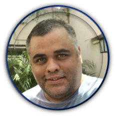

```{r setup, include=FALSE}
knitr::opts_chunk$set(echo = FALSE)

# Learn more about creating websites with Distill at:
# https://rstudio.github.io/distill/website.html

```

```{=html}
<style>
body {
text-align: justify}
</style>
```
```{r, echo=FALSE, out.width="40%", fig.align='center'}

```

## Do Fim Para o Começo

Comecei essa "minibiografia" de maneira inversa para quem possa estar interessado apenas na parte mais recente do que fiz. Detalhes de publicações podem ser observadas na aba publicações e/ou no meu lattes. Outras Atividades, mais na parte de estudo de novas ferramentas, estão na aba postagens que comecei a escrever recentemente.

## Pós-doutorado  (2017-2022)

Meu pós-doutoramento em Agronomia (Produção Vegetal) na UFPR foi supervisionado pelo professor Ricardo Augusto de Oliveira, coordenador do Programa de melhoramento da cana-de-açúcar da Rede Interuniversitária para o Desenvolvimento do setor sucroenergético da Universidade Federal do Paraná (PMGCA/RIDESA/UFPR). Durante meu primeiro ano de pós-doutoramento passei a morar em Paranavaí (PR), local estação experimental do PMGCA, lá eu pude acompanhar diariamente todas as atividades práticas desenvolvidas. Esse período foi importante para entender as necessidades do programa e pensar em como poderia contribuir para facilitar a vida da equipe.

Comecei auxiliando nas rotinas de análises dos mais diversos tipos de experimentos que envolvem todas as fases do programa de melhoramento buscando comunicar estes resultados de uma maneira simples e objetiva para todo o time. Despois de um ano na estação experimental, me mudei para Curitiba onde desenvolvi de pesquisa e aplicados no Centro de Ciências agrarias da Universidade Federal do Paraná.

No período em que estive universidade contribui com discentes da graduação e pós-graduação na parte de análise de dados. Com o advento da pandemia em 2020, passei a desenvolver meus trabalhos de maneira remota até o fim do pós-doutoramento em maio 2022. Durante o período da pandemia minhas principais atividades estavam relacionadas ao desenvolvimento de dashboards e alguns aplicativos para a obtenção de insights rápidos acerca das mais diferentes fontes de dados (meteorológicos, produção, fitopatológicos) obtidas pelo PMGCA. Durante este período eu desenvolvi nove dashboards em Power-bi e dois aplicativos em shiny cada um destes contendo algumas dezenas de visualizações e tabelas de análises.

# Quais são as minhas principais habilidades

Meu ponto forte é a parte aplicada de análise de modelos direcionadas ao melhoramento genético entregando as informações das mais diferentes maneiras (Dashbords, Aplicativos e relatórios). Buscando sempre a comunicação com a equipe para entender quais são as necessidades visando entregar as informações da maneira mais objetiva possível. Resumindo, eu gosto de resolver problema, para isso utilizo das mais diferentes ferramentas, como GENES, SELEGEN, PowerBi e R, sendo esta última a minha ferramenta favorita (Este site foi escrito em R/rmarkdown)( <https://rmarkdown.rstudio.com/>).

Isso só foi possível graças as disciplinas estudadas e as demandas (Universidade/Programa de melhoramento) aos quais me submeti a buscar a resposta durante toda a minha vida acadêmica. Outras fontes de aprendizado foram diversos livros e cursos online. 

```{r, echo=FALSE, fig.align='center', fig.cap= "Alguns dos cursos de capacaitação que fiz."}
knitr::include_graphics("capaci.gif")
```

## O Caminho Até Meu Pós-doutoramento

Minha trajetória acadêmica iniciou-se quando cursei agronomia na universidade federal da paraíba em 2006. No segundo semestre do curso conheci o laboratório de biotecnologia vegetal e o meu futuro orientador o professor Maílson Monteiro do Rêgo, que lecionava a disciplina de genética. Estagiei durante quase 4 anos com micropropagação (via cultivo in-vitro) de várias culturas, mas a grande influência no que eu queria fazer futuramente na época de graduação foi ser monitor de genética por dois anos.

Com a proximidade do final da graduação eu comecei a "cultivar" a ideia de tentar um mestrado, meu orientador e a esposa dele fizeram o doutorado na Universidade Federal de Viçosa, em minas gerais, e sempre falaram muito bem dos docentes desta instituição. Na verdade, a boa fama da UFV sempre foi forte para todos que passam pelas ciências agrárias/biológicas.

Passei na prova do processo de seleção na UFV dando início ao meu mestrado em Genética e Melhoramento, e posteriormente o doutorado no mesmo programa, no laboratório de bioinformática do professor Leonardo Lopes Behring. O professor Leonardo permitiu que eu escolhesse a cultura que era de meu interesse trabalhar uma vez que o foco do laboratório era análise de dados independentemente da existência física ou ou não (in-silico) de um experimento para ser analisado.

Nesta época havia um novo boom da cana-de-açúcar, com popularização cada vez maior dos carros flex além da aptidão natural da cultura para produção de açúcares. Isso fez com que a Monsanto, um grande player no mercado de melhoramento (hoje adquirida pala Bayer), comprasse uma empresa brasileira de melhoramento genético da cana-de-açúcar (CanaVialis). Esses motivos me fizeram iniciar meus estudos de doutorado e mestrado com a cultura da cana-de-açúcar tanto no mestrado quanto no doutorado.

Minha dissertação de mestrado contou com co-orientação do Prof. Márcio Resende Barbosa (coordenador da RIDESA/UFV), e teve como tema principal o estudo da depressão endogâmica em cana-de-açúcar. Já a minha tese de doutorado buscou desenvolver um índice de seleção baseado em lógica fuzzy para a seleção de colones promissores de cana-energia com dados coletados junto ao programa de melhoramento genético da cana de açúcar do Paraná (RIDESA/UFPR). Durante seis anos vivenciei a fama do ensino de ponta desta instituição e tive a oportunidade de conviver com excelentes profissionais das mais diversas áreas, dentro de fora da universidade. Todavia, com a proximidade do termino do doutorado fiquei com a sensação que deveria ter sugado mais o conhecimento disponível dentro do programa de melhoramento genético e isso me motivou a fazer o pós-doutorado na UFPR.

## Hobbies

-   Aos sábados tiro a "poeira dos dedos" tocando violão;
-   Também aos sábados aproveito para pilotar a churrasqueira assando um quase sempre belo churrasco;
- Além do churrasco cozinho quase todos os pratos que gosto de comer, justificando meu pequeno tamanho; 
-   "Engenhoqueiro" oficial que desmonta tudo e as vezes consegue arrumar na base da gambiarra e de vídeos do youtube;
-   Uma vez a cada uns dois anos me aventuro desenhando alguma coisa.
